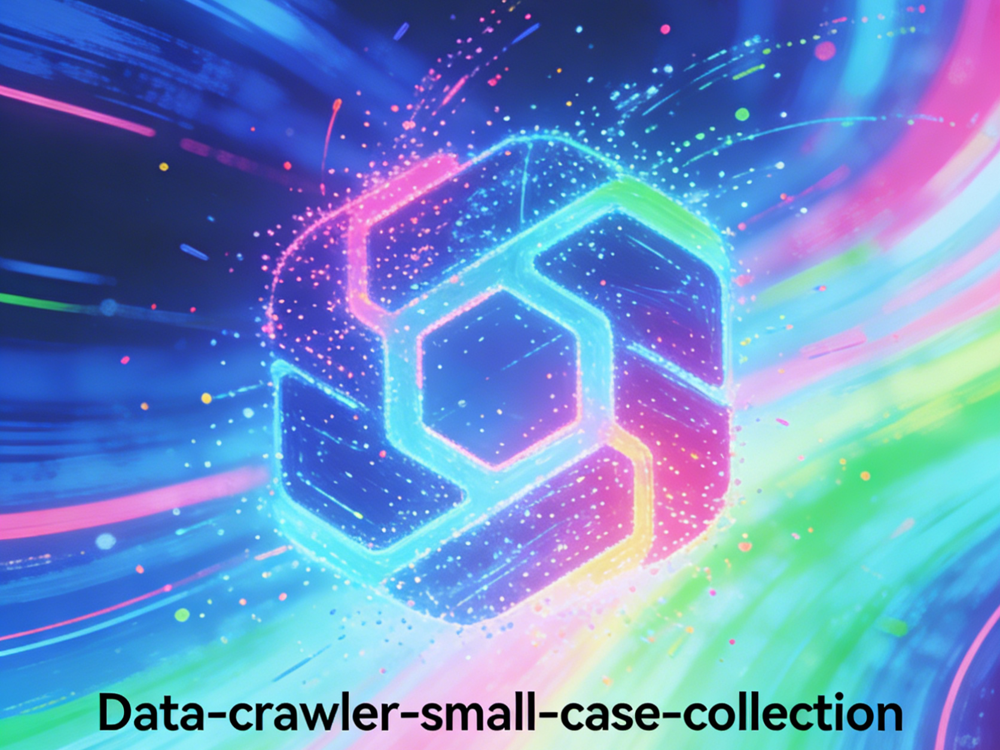

# 数据爬虫小案例合集 (Data-crawler-small-case-collection)

这是一个包含多个爬虫实战案例的项目，涵盖了静态网页爬取、动态网页（AJAX）爬取等场景，适合作为爬虫学习和实践的参考。




## 项目结构

```
Data-Analysis/
├── Code/                          # 核心代码与数据目录
│   ├── 任务要求.txt               # 项目任务说明
│   ├── 动态网页爬取：AJAX.ipynb   # 动态网页（AJAX）爬虫案例
│   ├── 励志-励志.csv              # 爬取到的励志名言数据
│   ├── 智联招聘-爬虫.csv           # 智联招聘岗位数据
│   ├── 智联招聘爬取.ipynb         # 智联招聘爬虫案例
│   └── 黑马网站爬取.ipynb         # 黑马程序员网站爬虫案例
├── Recording/                     # 学习记录目录
│   ├── assets/                    # 资源文件
│   ├── Crawler —— Learning experience.md  # 爬虫学习心得
│   └── 动态网页爬取.md            # 动态网页爬取学习笔记
└── README.md                      # 项目说明文档
```


## 项目简介

本项目是作者在学习数据爬虫技术过程中的实战案例集合，主要包含以下内容：

- **静态网页爬取**：从黑马程序员网站、励志名言网站等静态页面中提取数据。
- **动态网页爬取**：针对使用AJAX技术加载数据的网站，实现动态内容的抓取。
- **招聘数据爬取**：以智联招聘为例，演示如何从招聘平台获取岗位信息。

> **重要提示**：本项目仅供学习和研究使用，严禁用于任何非法途径或商业用途。所有使用者须严格遵守法律法规，并尊重网站的 `robots.txt` 协议及知识产权。


## 快速开始

### 环境要求

- Python 3.8+
- 核心依赖：`requests`, `BeautifulSoup4`, `pandas`, `selenium` 等

### 安装步骤

**克隆项目到本地**

```bash
git clone https://github.com/yourusername/Data-Analysis.git
cd Data-Analysis
```


## 案例说明

| 案例名称 | 技术要点 | 数据输出 |
| :--- | :--- | :--- |
| 黑马网站爬取 | 静态网页解析、BeautifulSoup | 课程/文章信息 |
| 励志名言爬取 | 静态网页解析、数据清洗 | `励志-励志.csv` |
| 智联招聘爬取 | 表单提交、分页爬取 | `智联招聘-爬虫.csv` |
| 动态网页爬取 | AJAX接口分析、requests | JSON数据解析 |

## 学习资源

如果需要查看详细的爬取过程，请访问以下两个文件：

- `Recording/Crawler —— Learning experience.md`：作者在爬虫学习过程中的心得体会与踩坑记录。
- `Recording/动态网页爬取.md`：针对AJAX动态加载技术的详细学习笔记和实践指南。


## 免责声明

本项目仅供学习和研究使用，严禁用于任何非法途径或商业用途。作者保留所有权利，并不对其可能的滥用承担任何责任。所有使用者须严格遵守法律法规，并尊重知识产权。


## 贡献指南

欢迎提交 Issue 与 Pull Request 来完善本项目。在提交代码前，请确保：
1. 代码符合项目的编码规范
2. 提交的修改有明确的目的和范围
3. 相关文档已同步更新
