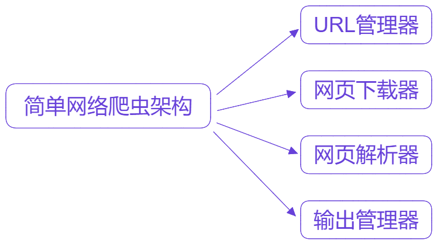
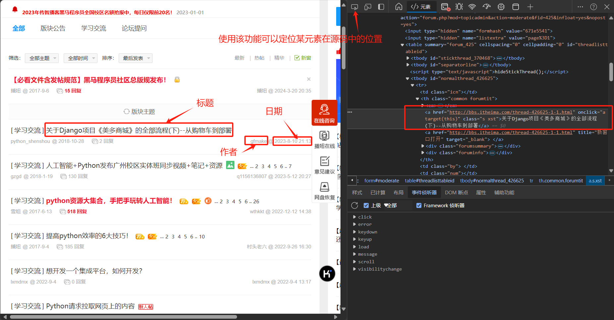
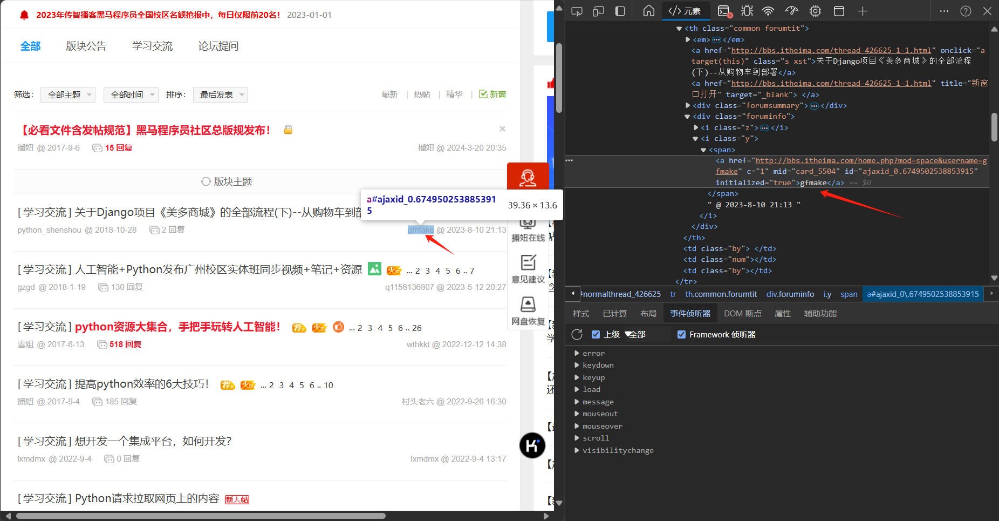
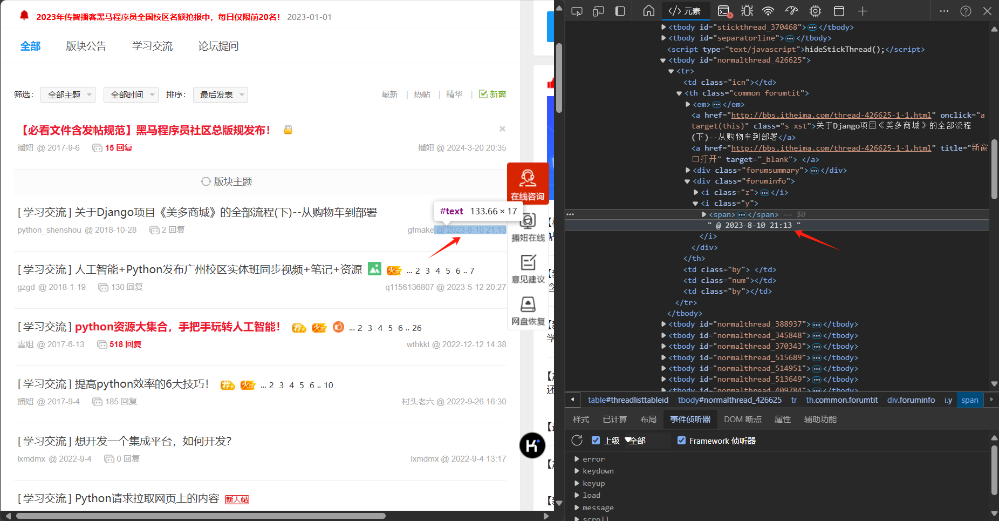
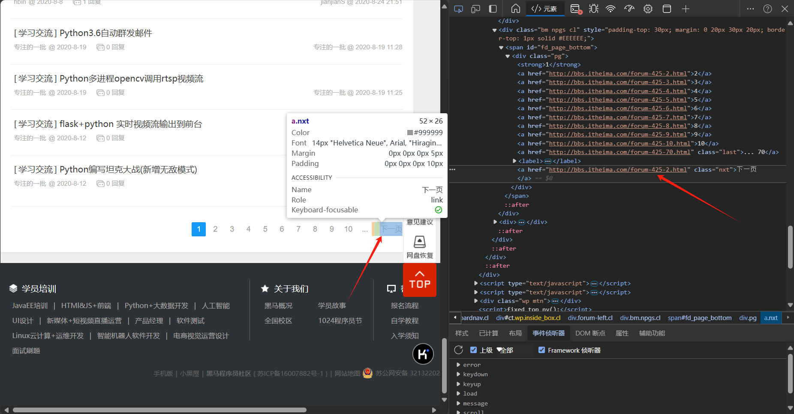

# Crawler —— Learning experience

## 数据的传输：

在OSI七层模型中，传输层为源主机和目标主机之间提供可靠的数据传输和通信服务，在该层中，有两个重要的协议—— TCP与 UDP协议。

### TCP协议（传输控制协议）

**主要特点：**

- 面向连接：TCP是一个面向连接的协议，这意味着在数据传输之前，发送方和接收方之间必须先建立一个可靠的连接。这个连接通过三次握手（Three-way Handshake）过程来建立，确保双方都已准备好进行数据传输。
- 可靠传输：TCP通过一系列机制来确保数据的可靠传输。
- 流量控制：TCP使用滑动窗口协议进行流量控制，防止发送方发送的数据量超过接收方的处理能力。
- 拥塞控制：TCP还包含拥塞控制机制，通过动态调整发送窗口大小来防止网络拥塞。
- 面向字节流：TCP将数据视为一个连续的字节流，而不是独立的数据报。

### UDP协议（用户数据报协议）

**主要特点：**

- 无连接：UDP是一个无连接的协议，发送方和接收方在数据传输之前不需要建立连接。这简化了协议的实现，并减少了延迟。
- 不可靠传输：UDP不提供确认、超时和重传机制，因此它不保证数据的可靠传输。数据可能会丢失、重复或乱序到达。
- 面向报文：UDP将每个应用层数据报视为一个独立的单元，保留了数据报的边界。
- 低开销：由于UDP没有复杂的连接建立和流量控制机制，它的开销较低，适用于对实时性要求较高但对可靠性要求不高的应用。
- 支持多播和广播：UDP支持多播和广播，允许数据同时发送给多个接收方。

### 区别：

- **TCP**：面向连接、可靠传输、流量控制和拥塞控制，适用于需要可靠传输的应用。
- **UDP**：无连接、不可靠传输、低开销，适用于对实时性要求较高且对少量数据丢失不敏感的应用。

### socket（套接字）

Python 的 `socket` 库提供了对 BSD socket 接口的访问，它允许你进行网络通信。`socket` 库支持多种类型的通信协议，包括 TCP、UDP 等。

> 基础知识：
>
> 1. Socket（套接字）：Socket用于表示网络通信的端点。在网络通信中，每个参与通信的程序都需要一个套接字来发送和接收数据。
> 2. Address(地址)：每个网络通信的参与者都有一个唯一的网络地址，通常由 IP 地址和端口号组成。
> 3. Protocol(协议)：定义了数据如何传输的规则，如 TCP、UDP。

`socket` 是 Python 的标准库之一，不需要额外安装，可直接导入使用。

```python
import socket
```

**主要函数：**

|      函数名称      |                 含义                 |
| :----------------: | :----------------------------------: |
| `socket.socket()`  |          创建一个新的套接字          |
|  `socket.bind()`   |      将套接字绑定到指定的地址上      |
| `socket.listen()`  | 使套接字进入监听状态，等待客户端连接 |
| `socket.accept()`  |            接受客户端连接            |
| `socket.connect()` |     客户端使用，用于连接到服务器     |
|  `socket.send()`   |               发送数据               |
|  `socket.recv()`   |               接收数据               |
|  `socket.close()`  |              关闭套接字              |

> **socket函数详解：**
>
> - **`socket.socket(family=AF_INET, type=SOCK_STREAM, proto=0, fileno=None)`**
>   - **作用**：创建一个新的套接字
>   - **参数**：
>     - `family`：指定通信协议族，如 `AF_INET` (IPv4) 或 `AF_INET6` (IPv6)。
>     - `type`：指定套接字类型，如 `SOCK_STREAM` (TCP) 或 `SOCK_DGRAM` (UDP)。
>     - `proto`：指定协议，通常设置为0，表示使用默认协议。
>     - `fileno`：如果指定，将现有的文件描述符包装为套接字对象。
>
> - **`socket.bind(address)`**
>   - **作用**：将套接字绑定到指定的地址。
>   - **参数**：
>     - `address`：一个元组 `(host, port)`，指定IP地址和端口号。
>
> - **`socket.listen(backlog)`**
> - `backlog`：指定在拒绝连接之前，可以挂起的最大连接数。
> - **`socket.accept()`**
>   - **作用**：使套接字进入监听状态，等待客户端连接。
>   - **参数**：
>     - 返回值：返回一个新的套接字对象和客户端的地址。
>
> - **`socket.connect(address)`**
>   - **作用**：客户端使用，用于连接到服务器。
>   - **参数**：
>     - `address`：一个元组 `(host, port)`，指定服务器的IP地址和端口号。
>
> - **`socket.send(data, flags=0)`**
>   - **作用**：发送数据。
>   - **参数**：
>     - `data`：要发送的数据，通常是一个bytes对象。
>     - `flags`：通常设置为0，表示使用默认行为。
>
> - **`socket.recv(bufsize, flags=0)`**
>   - **作用**：接收数据。
>   - **参数**：
>     - `bufsize`：指定接收数据的最大字节数。
>     - `flags`：通常设置为0，表示使用默认行为。
>
> - **`socket.sendto(data, address)`**
>   - **作用**：发送数据到指定地址，通常用于UDP。
>   - **参数**：
>     - `data`：要发送的数据。
>     - `address`：一个元组 `(host, port)`，指定接收方的地址。
>
>
> - **`socket.recvfrom(bufsize, flags=0)`**
>
>   - **作用**：接收数据和发送方的地址，通常用于UDP。
>
>   - 参数：
>
>     - `bufsize`：指定接收数据的最大字节数。
>     - `flags`：通常设置为0，表示使用默认行为。
>
> - **`socket.close()`**
>   - **作用**：关闭套接字
>
> - **`socket.getpeername()`**
>
>   - **作用**：返回连接到套接字的远程地址。
>
> - **`socket.getsockname()`**
>
>   - **作用**：返回套接字自己的地址。
>
> - **`socket.setsockopt(level, optname, value)`**
>
>   - **作用**：设置套接字选项。
>
>   - **参数**：
>
>     - `level`：指定协议级别，如 `SOL_SOCKET`。
>
>     - `optname`：指定要设置的选项名称，如 `SO_REUSEADDR`。
>     - `value`：指定选项的值。
>
> - **`socket.getsockopt(level, optname)`**
>
>   - **作用**：获取套接字选项的值。
>
>   - **参数**：
>
>     - `level`：指定协议级别。
>
>     - `optname`：指定要获取的选项名称。
>
> - **`socket.shutdown(how)`**
>
>   - **作用**：关闭套接字的一个方向。
>   - **参数**：
>
>     - `how`：指定关闭的方向，`SHUT_RD` 表示关闭接收方向，`SHUT_WR` 表示关闭发送方向，`SHUT_RDWR` 表示关闭双向。
>
>

#### TCP网络通讯实例：

==server.py==

```python
import socket

def server_program():
    # 获取主机名
    host = socket.gethostname()
    port = 5000     # 设置访问的端口号

    # 创建实例
    server_socket = socket.socket()
    # 绑定地址
    server_socket.bind((host, port))

    # 配置套接字，最多连接1个客户端
    server_socket.listen(1)
    print("Waiting for a connection...")
    # 进入监听状态
    conn, address = server_socket.accept()
    print("Connection from: " + str(address))
    
    while True:
        # 接收数据流，设置缓冲大小
        data = conn.recv(1024).decode()
        if not data:
            # 如果没有数据，跳出循环
            break
        print("From connected user: " + str(data))
        # 发送数据
        conn.send(data.encode())

    conn.close()  # 关闭连接

if __name__ == '__main__':
    server_program()
```

==client.py==

```python
import socket

def client_program():
    # 使用本地主机创建socket
    host = socket.gethostname()
    # 服务器的端口号
    port = 5000

    # 实例化套接字
    client_socket = socket.socket()
    # 连接到服务器
    client_socket.connect((host, port))

    message = input(" ->： ")  # 用户输入信息

    while message.lower().strip() != 'bye.':
        client_socket.send(message.encode())  # 发送消息
        # 接收响应
        data = client_socket.recv(1024).decode()  

        # 显示接收到的信息
        print("Received from server: " + data)  
        message = input(" -> ")  # 用户再次输入信息

    client_socket.close()  # 关闭连接

if __name__ == '__main__':
    client_program(
```

**运行结果：**


#### UDP网络通讯实例：

==server.py==

```python
import socket

def udp_server():
    # 本地主机地址
    host = '127.0.0.1'
    # 端口号
    port = 12345
    # 使用UDP协议进行创建socket实例
    server_socket = socket.socket(socket.AF_INET, socket.SOCK_DGRAM)
    # 绑定地址
    server_socket.bind((host, port))

    print("UDP server up and listening")

    while True:
        # 缓冲大小设为4096字节
        data, address = server_socket.recvfrom(4096)  
        print(f"Received message: {data.decode()} from {address}")
        # sent 表示发送的字节数
        sent = server_socket.sendto(data, address)
        print(f"Sent {sent} byte(s) back to {address}")

if __name__ == '__main__':
    udp_server()
```


==client.py==

```python
import socket

def udp_client():
    # 服务器的主机地址
    host = '127.0.0.1'  
    # 服务器的端口号
    port = 12345        

    client_socket = socket.socket(socket.AF_INET, socket.SOCK_DGRAM)

    message = input("Enter message to send: ")
    while message.lower().strip() != 'exit':
        client_socket.sendto(message.encode(), (host, port))
        # 缓冲大小设为4096字节
        data, server = client_socket.recvfrom(4096)  
        print(f"Received from server: {data.decode()}")

        message = input("Enter message to send: ")

    client_socket.close()

if __name__ == '__main__':
    udp_client()
```

**运行结果：**


## 简单的网络架构



**Python 网络爬虫技术：**

1. `HTTP` 请求：
   - `urllib`：Python的标准库之一，用于处理URL和发送HTTP请求
   - `Requests`：(**重要**)一个非常流行的第三方库，用于发送HTTP请求。它比`urllib`更易用，提供了简洁的 API。
2. 网页解析：
   - `re`：正则表达式库，是 Python 的标准库之一，允许你执行诸如字符串搜索、替换、分割和匹配等操作。
   - `lxml`：(**重要**)一个高性能的XML和HTML解析库，基于C语言实现，解析速度快。
   - `Beautiful Soup`：是一个利用Python标凑库构建的库，专门用于解析HTML和XML文档。它提供了简单直观的API来处理文档，并且能够自动处理文档的编码问题。
3. 爬虫框架：
   - `Scrapy`：一个用Python编写的开源网络爬虫框架，它被设计用于抓取网站数据和提取结构化数据。Scrapy使用Twisted异步网络框架来处理网络通信，这使得它能够快速地进行数据下载。
   - `PySpider`： 是一个强大的、开源的 Python 网络爬虫系统
   - `Cola`：是一个企业级应用架构的最佳实践，它旨在简化应用架构的复杂性，提供清晰的指导和约束。

## urllib

**主要函数：**

|                     函数名称                      |                             含义                             |
| :-----------------------------------------------: | :----------------------------------------------------------: |
|            `urllib.request.urlopen()`             |            打开一个 URL 并返回一个类似文件的对象             |
| `urllib.request.Request(url: str, headers: dict)` |       用于创建一个请求对象，可以添加 HTTP 请求头等信息       |
|         `urllib.parse.urlparse(url: str)`         |                      将 URL 分解成组件                       |
|      `urllib.parse.urlunparse(url_ls: list)`      |               将分解后的组件重新组合成一个 URL               |
|              `urllib.parse.quote()`               |                    将字符串进行 URL 编码                     |
|             `urllib.parse.unquote()`              |                    解码 URL 编码的字符串                     |
|              `urllib.error.URLError`              |                    当无法打开 URL 时抛出                     |
|             `urllib.error.HTTPError`              |                当 HTTP 请求返回错误响应时抛出                |
|               `urllib.robotparser`                | 用于解析 robots.txt 文件，这些文件用于告诉网络爬虫哪些页面可以访问 |

### 实例

==example_1.py==

```python
import urllib.request

# 请求头
headers = {'User-Agent': 'Mozilla/5.0 (Windows NT 10.0; Win64; x64) AppleWebKit/537.36 (KHTML, like Gecko) Chrome/46.0.2490.80 Safari/537.36'}
# 创建一个 Request 对象
req = urllib.request.Request('http://www.baidu.com', headers=headers)

# 打开 URL
with urllib.request.urlopen(req, timeout=3) as response:
    # 读取响应内容
    html = response.read()

# 打印 HTML 内容
print(html.decode('utf-8'))
```

对于响应的`response`，可以使用`response.geturl()`来获取当前所爬取的 URL 地址，还可以使用`response.getcode()`来查看网页的状态码。

==example_2.py==

```python
from urllib.parse import urlencode

# 创建一个字典，包含查询参数
params = {
    'q': 'Python',
    'page': 1
}

# 编码查询字符串
query_string = urlencode(params)

# 打印编码后的查询字符串
print(query_string)
```

==post.py==

```python
# 发送post请求
from urllib import request, parse
post_data = parse.urlencode([('key1', 'value1'),
                            ('key2', 'value2')])

url = request.Request('http://httpbin.org/post')
url.add_header('User-Agent', 'Mozilla/5.0 (Windows NT 10.0; Win64; x64) AppleWebKit/537.36 (KHTML, like Gecko) Chrome/46.0.2490.80 Safari/537.36')
response = request.urlopen(url, data=post_data.encode('utf-8')).read()
```

==robots.py==

```python
from urllib.robotparser import RobotFileParser

# 创建 RobotFileParser 对象
rp = RobotFileParser()

# 设置 robots.txt 文件的 URL
rp.set_url("http://www.baidu.com/robots.txt")

# 读取并解析 robots.txt 文件
rp.read()

# 检查某个用户代理是否可以获取指定的页面
can_fetch = rp.can_fetch("*", "http://www.baidu.com/somepage.html")
print(can_fetch)

'''
can_fetch() 方法接受两个参数：
第一个是用户代理字符串（通常是 * 表示所有用户代理），第二个是想要访问的 URL。
如果返回 True，则表示可以抓取；如果返回 False，则表示不可以抓取。
'''
```


## requests

requests 库是一个第三方库，需要自行安装。

```powershell
pip3 install requests		# python3
```

### 主要函数

#### 发送请求:

1. `requests.get(url, params=None, \**kwargs)`:
   - 发送一个 HTTP GET 请求。
   - `params`: 一个字典或字节序列，将会被发送在查询字符串中。
   - `**kwargs`: 其他关键字参数将传递给 `Request` 类。
2. `requests.post(url, data=None, json=None, \**kwargs)`:
   - 发送一个 HTTP POST 请求。
   - `data`: 要发送的表单数据，字典或字节序列。
   - `json`: 要发送的 JSON 数据。
   - `**kwargs`: 其他关键字参数将传递给 `Request` 类。同 get 请求。
3. `requests.put(url, data=None, \**kwargs)`:
   - 发送一个 HTTP PUT 请求。
   - `data`: 要发送的请求数据。
   - `**kwargs`: 其他关键字参数将传递给 `Request` 类。同 get 请求。
4. `requests.delete(url, \**kwargs)`:
   - 发送一个 HTTP DELETE 请求。
   - `**kwargs`: 关键字参数将传递给 `Request` 类。同 get 请求。
5. `requests.head(url, \**kwargs)`:
   - 发送一个 HTTP HEAD 请求。
   - `**kwargs`: 关键字参数将传递给 `Request` 类。同 get 请求。
6. `requests.patch(url, data=None, \**kwargs)`:
   - 发送一个 HTTP PATCH 请求。
   - `data`: 要发送的请求数据。
   - `**kwargs`: 关键字参数将传递给 `Request` 类。同 get 请求。
7. `requests.options(url, \**kwargs)`:
   - 发送一个 HTTP OPTIONS 请求。
   - `**kwargs`: 关键字参数将传递给 `Request` 类。同 get 请求。

上述发送请求的函数中可选参数 `\**kwargs` 基本相同，因为它们最终都会传递给 `requests` 库内部的 `Request` 类，常见的 `**kwargs` 参数：

- `params`: 用于传递 URL 的查询字符串参数。可以是字典、字节序列或元组列表。
- `headers`: 自定义 HTTP 请求头。
- `cookies`： 用于发送 cookies，可以是字典或 `RequestsCookieJar` 对象。
- `timeout`: 指定请求的超时时间。
- `auth`: 用于 HTTP 认证的元组 `(username, password)`。
- `proxies`: 指定代理服务器的字典。
- `verify`: 用于控制 SSL 证书验证，可以是布尔值或证书路径。
- `stream`: 如果为 `False`，则响应内容将立即下载。
- `allow_redirects`: 是否自动处理重定向。
- `data`: 用于 `requests.post` 和其他方法，但对于 `requests.delete` 方法，你也可以通过 `**kwargs` 传递。
- `json`: 用于 `requests.post` 方法，但通常不用于 `requests.delete`，除非你明确需要发送 JSON 数据。
- `files`: 用于上传文件。

```python
import requests

# 豆瓣电影API的URL，这里以获取电影《肖申克的救赎》的详细信息为例
movie_id = '1292052'  # 肖申克的救赎的豆瓣ID
url = f'https://movie.douban.com/subject/{movie_id}'

headers = {'User-Agent': 'Mozilla/5.0 (Windows NT 10.0; Win64; x64) AppleWebKit/537.36 (KHTML, like Gecko) Chrome/46.0.2490.80 Safari/537.36'}
# 发送GET请求
response = requests.get(url, headers=headers, timeout=3)

# 检查请求是否成功
if response.status_code == 200:
    print(response.text)
else:
    print("请求失败，状态码：", response.status_code)

# 处理可能的异常
try:
    response.raise_for_status()
except requests.exceptions.HTTPError as e:
    print("HTTP错误:", e)
except requests.exceptions.ConnectionError as e:
    print("连接错误:", e)
except requests.exceptions.Timeout as e:
    print("请求超时:", e)
except requests.exceptions.RequestException as e:
    print("请求出错:", e)
```

#### 返回内容：

使用 `requests` 进行请求时，返回一个`response`对象，该对象包含以下属性：

- `status_code`：服务器响应的HTTP状态码。
- `headers`：服务器响应的HTTP头部字段。
- `content`：服务器响应的内容，通常是字节类型。
- `text`：服务器响应的内容，解码为字符串（默认使用ISO编码）。
- `json()`：如果响应内容是JSON格式，这个方法可以解析JSON并返回一个字典。

#### 会话管理:

- `Session` 对象允许你在多个请求之间保持某些参数，比如 cookies、headers 等。
- `session.get(url, **kwargs)`: 在会话中发送一个 GET 请求。
- `session.post(url, data=None, json=None, **kwargs)`: 在会话中发送一个 POST 请求。

```python
import requests

# 创建一个 Session 对象
session = requests.Session()

# 你可以设置一些默认的请求参数
session.headers.update({'user-agent': 'my-app/0.0.1'})

# 发送第一个请求
response_one = session.get('http://www.baidu.com')
print(response_one.text)

# 发送第二个请求，Session 会自动处理 cookies
response_two = session.get('https://blog.csdn.net/')
print(response_two.text)

# 关闭 Session
session.close()
```

#### 请求构造:

- `Request(method, url, **kwargs)`: 创建一个请求对象，可以用于 `Session` 对象的 `send` 方法。

  - 参数详解：
    - **method**：指定请求的 HTTP 方法。这是必需的。
    - **url**：请求的目标 URL。这也是必需的。
    - **params**：字典或字节序列，将会被编码为 URL 的查询字符串。
    - **data**：作为请求体发送的字典、字节序列或文件对象。
    - **json**：字典或列表，将会被编码为 JSON 格式并发送。
    - **headers**：字典，包含请求头。
    - **cookies**：字典或 CookieJar 对象，包含要发送的 cookies。
    - **files**：字典，包含要上传的文件。
    - **auth**：元组，包含用户认证信息。
    - **timeout**：浮点数或元组，指定请求的超时时间。

  ```python
  import requests
  
  # 创建一个 Request 对象
  req = requests.Request('GET', 'http://example.com')
  
  # 添加额外的参数
  req.headers.update({'User-Agent': 'Mozilla/5.0 (Windows NT 10.0; Win64; x64) AppleWebKit/537.36 (KHTML, like Gecko) Chrome/46.0.2490.80 Safari/537.36'})
  
  # 准备请求
  prepared_req = req.prepare()
  
  # 创建一个 Session 对象
  with requests.Session() as session:
      # 使用 Session 的 send 方法发送准备好的请求
      response = session.send(prepared_req)
      print(response.text)
  ```

#### 响应对象:

- 每个请求方法返回一个 `Response`对象，包含以下属性和方法：
  - `status_code`: HTTP 状态码。
  - `headers`: 响应头。
  - `text`: 响应体作为 Unicode。
  - `content`: 响应体作为字节。
  - `json()`: 解析 JSON 响应体。
  - `raise_for_status()`: 如果响应码指示错误，则抛出一个异常。

#### 异常处理:

- `requests` 定义了一系列异常，例如 `HTTPError`, `ConnectionError`, `Timeout`, `RequestException` 等，用于处理请求中可能出现的错误。

  - 常见的 requests 异常：
    - **RequestException**：这是所有 `requests` 异常的基类。通常，你可以通过捕获这个异常来处理所有请求相关的错误。
    - **HTTPError**：当响应的 HTTP 状态码表示错误时（例如 4xx 或 5xx），会抛出这个异常。
    - **ConnectionError**：当网络连接问题导致请求失败时，会抛出这个异常。
    - **Timeout**：当请求超过指定的超时时间时，会抛出这个异常。
    - **TooManyRedirects**：当请求超过了最大重定向次数时，会抛出这个异常。
    - **MissingSchema**、**InvalidSchema**、**InvalidURL**：这些异常与 URL 格式不正确有关。
    - **ChunkedEncodingError**：当服务器声明使用分块传输编码，但实际上没有正确发送数据时，会抛出这个异常。
    - **ContentDecodingError**：当服务器返回的内容无法正确解码时，会抛出这个异常。
    - **StreamConsumedError**：当尝试多次读取已经读取过的响应内容时，会抛出这个异常。

  ```python
  import requests
  from requests.exceptions import HTTPError, ConnectionError, Timeout
  
  url = 'http://example.com'
  
  try:
      response = requests.get(url, timeout=5)
      # 确保响应状态码为 200
      response.raise_for_status()
  except HTTPError as http_err:
      print(f'HTTP error occurred: {http_err}')  # HTTP错误
  except ConnectionError as conn_err:
      print(f'Connection error occurred: {conn_err}')  # 连接错误
  except Timeout as timeout_err:
      print(f'Timeout error occurred: {timeout_err}')  # 超时错误
  except Exception as err:
      print(f'Other error occurred: {err}')  # 其他错误
  else:
      print('Success!')
  ```

- **高级特性**:
  - 支持代理、Cookie、认证、SSL 证书验证等高级特性。

  ==proxies==

  ```python
  import requests
  
  # 代理服务
  proxies = {
    'http': 'http://10.10.1.10:3128',
    'https': 'http://10.10.1.10:1080',
  }
  
  response = requests.get('http://example.com', proxies=proxies)
  print(response.text)
  ```

  

  ==Cookie.py==

  ```python
  import requests
  
  # 手动设置 cookies
  cookies = dict(cookies_are='working')
  
  response = requests.get('http://example.com', cookies=cookies)
  print(response.text)
  ```

  ==SSl.py==

  ```python
  import requests
  
  # 禁用 SSL 证书验证
  response = requests.get('https://example.com', verify=False)
  
  # 使用自定义的证书文件, verify 是SSL证书路径
  response = requests.get('https://example.com', verify='/path/to/certfile')
  ```

## lxml

`lxml` 是一个 Python 第三方库，它提供了非常高效的 XML 和 HTML 文件解析工具。`lxml` 基于 libxml2 和 libxslt 库，这些是 C 语言编写的高性能、低内存占用的库，因此 `lxml` 在解析大型文件时尤其有用。

### 安装：

`lxml` 是一个第三方库，需要自行安装。

```powershell
pip3 install lxml	# python3
```

### 使用方法：

1. 导入 `lxml.etree` 模块：

   ```python
   from lxml import etree
   ```

2. 解析 HTML 时，需要先初始化 HTML 源码：

   ```python
   selector = etree.HTML(html)		# html 表示爬取到的 HTML 源码。
   ```

3. 寻找某个标签的时候，可以从根节点进行爬取，默认根节点为 `//`，如要爬取 `<li>` 标签，且该标签的路径为：`<div> => <ul> => <li>`。

   ```python
   all_li = selector.xpath('//div/ul/li')		# 爬取到 <ul> 路径下的所有的 <li> 标签。
   ```

4. 定位到具体的某一个标签，可以在参数最后使用 `[idx]` 来定位，序号从==1==开始如：

   ```python
   li_1 = selector.xpath('//div/ul/li[1]')
   ```

5. 提取某标签下的文本，可以在参数最后使用一级`/text()`来提取，返回一个列表对象，如提取第一个 `<li>` 标签下的 `<a>` 标签的文本：

   ```python
   li_1_a_text = selector.xpath('//div/ul/li[1]/text()')
   ```

6. 如果某一个标签在 HTML 源码中时唯一的，可以直接从根节点定位到该标签，而不需要一级一级的定位，如 `<ul>` 标签是唯一的，可以直接定位到 `<ul>`：

   ```python
   li_1_a_text = selector.xpath('//ul/li[1]/text()')[0]		# 这里 [0] 表示提取返回列表的第一个值。
   ```

7. 通过属性定位标签，可以在对应标签后使用`[@class="..."]` 来定位某个具体的标签：

   ```python
   li_3 = selector.xpath('//ul/li[@class="item-inactive"]')
   ```

8. 如果某个标签对应的属性在整个 HTML 源码里是唯一的，可以从根节点直接定位到该标签：

   ```python
   li_3 = selector.xpath('//*[@class="item-inactive"]')	# * 表示任意标签
   
   li_3_a_text = selector.xpath('//*[@class="item-inactive"]/a/text()')	# 提取 a 标签下的文本
   
   li_3_a_text = selector.xpath('//a[@class="item-inactive"]/text()')	# 直接使用 a 标签的属性进行定位
   ```

9. 提取某标签的属性值，如果要提取属性值，可以直接在参数中添加一级属性的名称即可，如：

   ```python
   li_3_a_href = selector.xpath('//ul/li[3]/a/@href')		# 提取出第三个 li 标签的属性
   
   all_class = selector.xpath('//li/@class')				# 提取所有 li 标签的 class 属性
   ```

10. 提取以某部分开头的属性，如多个属性值都以 `item-` 开头，可以使用 `starts-with()` 语法进行提取，如：

    ```python
    li_1_5 = selector.xpath('//li[starts-with(@class, "item-")]')
    ```

11. 如果提取出来的元素包含的仍然是一个代码段，可以对它继续使用 XPath 进行查找，可以将当前的节点作为根节点来进行查找，使用 `.//` 表示相对根节点：

    ```python
    li_1_5_a_text = []
    for li in li_1_5:
        li_1_5_a_text.append(li.xpath('a/text()'))[0]
        
    # 下面的代码等价于上面的
    li_1_5_a_text = selector.xpath('//li[starts-with(@class=, "item-")/a/text()]')
    ```

12. 提取某标签下的所有文本，如 提取 `<ul>` 标签下的所有标签的文本：

    ```python
    all_text = selector.xpath('string(//ul)')
    
    # 使用列表推导式来提取所有文本
    all_str_text = [s.strip() for s in all_text.strip().split('\n')]
    ```

## Beautiful Soup

Beautiful Soup 是一个用于解析 HTML 和 XML 文档的 Python 库。它常被用于网页抓取和数据提取。

### 安装：

`Beautiful Soup` 是一个第三方库，需要自行安装。

```shell
pip3 install beautifulsoup4
```

### 使用方法：

1. 导入 `BeautifulSoup` 模块：

   ```python
   from bs4 import BeautifulSoup
   ```

2. 创建解析器，第一个参数是 HTML 源码，第二个参数是解析器类型：

   ```python
   soup = BeautifulSoup(html_doc, 'html.parser')  	# 使用 Python 的内置解析器
   soup = BeautifulSoup(html_doc, 'lxml')  		# 使用 lxml 解析器
   soup = BeautifulSoup(html_doc, 'html5lib')		# 使用 html5lib 解析器
   ```

   如果要使用 `lxml` 解析器 或 `html5lib` 解析器，需要额外进行安装：

   ```shell
   pip install lxml
   pip3 install html5lib
   ```

3. 获取所有具有特定类的 `<a>`标签：

   ```python
   links = soup.find_all('a', class_='class-name')
   ```

4. 使用 CSS 选择器，`select()` 方法，基本语法为 `elements = soup.select('CSS_SELECTOR')`，`CSS_SELECTOR` 是一个字符串，表示你想要使用的 CSS 选择器：

   1. **标签选择器**：通过标签名选择元素。

      ```python
      soup.select('div')  # 选择所有 <div> 标签
      ```

   2. **类选择器**：通过类名选择元素。

      ```python
      soup.select('.class-name')  # 选择所有类名为 "class-name" 的元素
      ```

   3. **ID 选择器**：通过 ID 选择特定的元素。

      ```python
      soup.select('#id-name')  # 选择 ID 为 "id-name" 的元素
      ```

   4. **属性选择器**：通过元素的属性选择元素。

      ```python
      soup.select('a[href="http://example.com"]')  # 选择 href 属性为 "http://example.com" 的所有 <a> 标签
      ```

   5. **组合选择器**：组合多个选择器来细化搜索条件。

      ```python
      soup.select('div.class-name#id-name')  # 选择类名为 "class-name" 且 ID 为 "id-name" 的 <div> 标签
      ```

   6. **后代选择器**：使用空格分隔，选择作为某元素后代的所有元素。

      ```python
      soup.select('div a')  # 选择所有在 <div> 标签内的 <a> 标签
      ```

   7. **子元素选择器**：使用 `>` 符号，选择作为某元素直接子元素的元素。

      ```python
      soup.select('div > a')  # 选择所有 <div> 标签的直接子元素 <a> 标签
      ```

   8. **相邻兄弟选择器**：使用 `+` 符号，选择紧随指定元素之后的相邻兄弟元素。

      ```python
      soup.select('a + p')  # 选择所有紧随 <a> 标签之后的 <p> 标签
      ```

   9. **通用兄弟选择器**：使用 `~` 符号，选择指定元素之后的所有兄弟元素。

      ```python
      soup.select('a ~ p')  # 选择所有在 <a> 标签之后的所有 <p> 标签
      ```

   10. **伪类选择器**：使用 CSS 伪类选择器来选择元素。

       ```python
       soup.select('p:first-child')  # 选择每个父元素的第一个 <p> 子元素
       ```

   - 返回值

     `select()` 方法返回一个列表，其中包含所有匹配 CSS 选择器的元素。如果没有找到匹配的元素，它将返回一个空列表。

       ```python
       divs = soup.select('div.class-name')
       ```

5. **搜索文档树**：

   - `find()`：返回第一个匹配的元素，语法：`tag = soup.find(name, attrs, recursive, text, **kwargs)`，每一个参数都是一个可选参数。

     - **name**：
       - 字符串或`None`。
       - 要搜索的标签名。如果设定为`None`，则忽略此参数。

     - **attrs**：
       - 字典类型。
       - 要搜索的标签的属性。字典的键是属性名，值是属性值。只有当标签具有这些属性时，它才会被匹配。
     - **recursive**：
       - 布尔值。
       - 指定搜索是否包括子孙标签。默认为`True`，如果设置为`False`，则只在当前标签的直接子标签中搜索。
     - **text**：
       - 字符串或`None`。
       - 要搜索的标签的文本内容。如果设定为`None`，则忽略此参数。
     - **kwargs**：
       - 关键字参数。
       - 任何额外的关键字参数都会传递给解析器。
     - `find()` 方法只返回第一个匹配的元素。如果你想要找到所有匹配的元素，应该使用`find_all()`方法。

     ```python
     from bs4 import BeautifulSoup
     
     # 示例 HTML 文档
     html_doc = """
     <html>
     <head>
         <title>The title of the document</title>
     </head>
     <body>
         <div id="div1" class="someclass">
             <p>This is the first paragraph</p>
             <a href="http://example.com">Example link</a>
         </div>
         <div id="div2" class="someclass">
             <p>This is the second paragraph</p>
             <a href="http://example.org">Example link 2</a>
         </div>
     </body>
     </html>
     """
     
     # 创建 Beautiful Soup 对象
     soup = BeautifulSoup(html_doc, 'html.parser')
     
     # 通过标签名查找
     p_tag = soup.find('p')
     print(p_tag)  # 输出第一个 <p> 标签
     
     # 通过属性查找
     a_tag = soup.find('a', href=True)
     print(a_tag)  # 输出第一个有 href 属性的 <a> 标签
     
     # 通过属性字典查找
     a_tag_with_specific_href = soup.find('a', attrs={'href': 'http://example.com'})
     print(a_tag_with_specific_href)  # 输出具有特定 href 属性的 <a> 标签
     
     # 通过文本查找
     text_tag = soup.find(text="This is the first paragraph")
     print(text_tag)  # 输出包含特定文本的第一个标签
     
     # 使用关键字参数查找
     div_tag = soup.find(id="div1")
     print(div_tag)  # 输出具有特定 id 属性的 <div> 标签
     ```

   - `find_all()`：返回所有匹配的元素列表，语法：`find_all(name, attrs, recursive, string, limit, **kwargs)`, 每一个参数都是可选参数。

     - **name**：
       - 字符串或正则表达式。
       - 要搜索的标签名。可以使用正则表达式来匹配标签名。
     - **attrs**：
       - 字典类型。
       - 要搜索的标签的属性。字典的键是属性名，值是属性值。只有当标签具有这些属性时，它才会被匹配。
     - **recursive**：
       - 布尔值。
       - 指定是否递归地在子标签中查找。默认为 `True`。
     - **text**：
       - 字符串或正则表达式。
       - 要搜索的标签的文本内容。
     - **limit**：
       - 整数。
       - 用于限制返回结果的数量。
     - **kwargs**：
       - 关键字参数。
       - 任何额外的关键字参数都会被视为要匹配的元素的属性名和属性值。
     - `find_all()` 方法返回一个列表，如果没有找到匹配的元素，则返回一个空列表。

     ```python
     from bs4 import BeautifulSoup
     
     html_doc = """
     <html>
     <head>
         <title>The Dormouse's story</title>
     </head>
     <body>
         <div id="div1" class="someclass">
             <p>This is the first paragraph</p>
             <a href="http://example.com">Example link</a>
         </div>
         <div id="div2" class="someclass">
             <p>This is the second paragraph</p>
             <a href="http://example.org">Example link 2</a>
         </div>
     </body>
     </html>
     """
     
     soup = BeautifulSoup(html_doc, 'html.parser')
     
     # 查找所有 <p> 标签
     p_tags = soup.find_all('p')
     for p in p_tags:
         print(p)
     
     # 查找所有具有特定类的 <div> 标签
     divs_with_class = soup.find_all('div', class_='someclass')
     for div in divs_with_class:
         print(div)
     
     # 查找所有包含特定文本的 <a> 标签
     links_with_text = soup.find_all('a', text='Example link')
     for link in links_with_text:
         print(link)
     
     # 使用属性字典查找
     divs_with_attrs = soup.find_all('div', attrs={'class': 'someclass'})
     for div in divs_with_attrs:
         print(div)
     
     # 使用 limit 参数限制结果数量
     limited_results = soup.find_all('p', limit=1)
     for result in limited_results:
         print(result)
     ```

6. 获取和修改标签属性：

   ```python
   tag = soup.find('a', href=True)
   tag['href'] = 'http://newlink.com'
   ```

7. 获取标签内的文本：

   ```python
   text = tag.get_text()
   ```

8. 获取去除了标签的文本内容：

   ```python
   stripped_text = tag.get_text(strip=True)
   ```

9. 添加新的标签：

   ```python
   from bs4 import BeautifulSoup
   
   # 假设我们有一段简单的 HTML
   html_doc = "<html><body></body></html>"
   soup = BeautifulSoup(html_doc, 'html.parser')
   
   # 创建一个新的 <p> 标签
   new_tag = soup.new_tag('p')
   
   # 设置新标签的内容
   new_tag.string = 'New paragraph'
   
   # 将新标签添加到文档的 <body> 部分
   soup.body.append(new_tag)
   
   # 打印修改后的 HTML
   print(soup.prettify())
   ```

10. 替换现有的标签：

    ```python
    tag.replace_with('New text')
    ```

11. 格式化输出 HTML：

    ```python
    print(soup.prettify())
    ```

12. 指定编码输出：

    ```python
    from bs4 import BeautifulSoup
    
    # 假设我们有一段简单的 HTML
    html_doc = "<html><head><title>Page Title</title></head><body><p>Some content</p></body></html>"
    soup = BeautifulSoup(html_doc, 'html.parser')
    
    # 将解析后的 HTML 文档转换为字符串
    html_string = str(soup)
    
    # 使用字符串的 encode 方法进行编码
    encoded_data = html_string.encode('latin-1')
    
    # 打印编码后的数据
    print(encoded_data)
    ```

14. 如果解析器无法解析文档，可以尝试更换解析器，例如从 `html.parser` 切换到 `lxml` 或 `html5lib`。

15. 使用 `lxml` 解析器可以提高解析速度。

16. 如果处理非 UTF-8 编码的文档，可以在创建 Beautiful Soup 对象时指定 `from_encoding` 参数。

## re 正则表达式

### 简介

正则表达式（Regular Expression，简称regex或regexp）是一种文本模式描述的方法，它可以用来检索、替换符合某个模式（规则）的文本。正则表达式由一系列字符组成，这些字符可以是普通字符（例如，字母a到z）、特殊字符（称为"元字符"）或两者的组合。

### 学习链接：

**博客（CSDN）**：[Re - 正则表达式（附带大量python实例）_python正则匹配条件-CSDN博客](https://blog.csdn.net/qq_73910510/article/details/138817920?spm=1001.2014.3001.5502)

## 案例一：爬取黑马程序员网址

**链接地址**：[python技术交流论坛 (itheima.com)](http://bbs.itheima.com/forum-425-1.html)

**目标**：爬取每一页的**标题**、**作者**、**日期**

**第三方库**：

- `requests`
- `lxml`
- `random`
- `time`

### 标题：

通过浏览器的调试功能（F12 快捷键）可以定位到标题元素在源码中的位置：



可以看到标题元素在`<a>`标签中，并且该标签在`<table id = "threadlisttableid">`标签下，并且通过观察可以看到所有的标题都在各个`<table id = "threadlisttableid">`标签下，并且`<table id = "threadlisttableid">`该标签是独立的（相对唯一），因此可以使用属性定位来定位到所有的`<table id = "threadlisttableid">`标签，然后在向下搜索得到需要的值，代码编写如下：

```python
title_temp = selector.xpath('//table[@id="threadlisttableid"]/tbody/tr/th/a[@class="s xst"]/text()')
```

### 作者：



通过观察可以看到各个作者标签都在在各个`<div class="foruminfo">`的标签下，且是独立的（相对唯一），因此同样可以使用属性定位到该标签，之后一个标签为`<span>`标签，代码编写如下：

```python
author_temp = selector.xpath('//div[@class="foruminfo"]/i[2]/span/a/text()')
```

### 日期：



与**作者**分析一样，日期标签也在各个`<div class="foruminfo">`标签下，因此也可以使用属性定位来找到该标签，不同的是，日期标签是`<div class="foruminfo">`下的第二个子标签`<i>`，因此可以使用索引的方式来进行定位，代码如下：

```python
date_temp = selector.xpath('//div[@class="foruminfo"]/i[2]/text()')
```

### 爬取所有页面：

由于该网址是分页的，一次爬取只能得到一页的数据，但我们需要的是全部的数据，因此需要找到一种方式来爬取所有的页面。

再次分析网页，可以发现，存在**下一页**按钮，并且**下一页**按钮对应的源码中，其属性就是下一页的网址，所以我们可以不断的爬取每一页的**下一页**网页，然后不断请求，直到不存在**下一页**按钮，即返回一个**空列表**时，爬取结束，**下一页**按钮在源码中定位如下：



细心的观察，可以发现，**下一页**按钮只存在于`<a class="nxt">`标签中，因此可以直接使用属性定位直接定位到该标签，然后取其`href`属性值即可，代码编写如下：

```python
next_temp = selector.xpath('//a[@class="nxt"]/@href')
```

如此，我们可以使用函数来封装**请求**和**解析**的方法，然后使用`while`循环来进行不断的爬取，结束条件为`while next_url != []`，这里我们使用`random`和`time`库，来对爬取的时间进行随机休眠，以削减爬取的频率。

### 完整代码：

```python
import requests
from lxml import etree
import time
import random


URL = "http://bbs.itheima.com/forum-425-1.html"
headers = {'User-Agent': 'Mozilla/5.0 (Windows NT 10.0; Win64; x64) AppleWebKit/537.36 (KHTML, like Gecko) Chrome/125.0.0.0 Safari/458.22'}
# 请求函数
def Crawling(url: str): 
    print('Crawling URL is :', url)
    response = requests.get(url=url, headers=headers, timeout=3)
    if response.status_code == requests.codes.ok:
        time.sleep(random.uniform(1.0, 2.5))	# 进行1秒 ~ 2.5秒的随机休眠
        return response
    else:
        print("Error")
        return None
# 解析函数
def parse(response_parameter):
    selector = etree.HTML(response_parameter.content)
    
    # 解析标题
    title_temp = selector.xpath('//table[@id="threadlisttableid"]/tbody/tr/th/a[@class="s xst"]/text()')
    # 解析日期
    date_temp = selector.xpath('//div[@class="foruminfo"]/i[2]/text()')
    # 解析作者
    author_temp = selector.xpath('//div[@class="foruminfo"]/i[2]/span/a/text()')
    # 下一页地址
    next_temp = selector.xpath('//a[@class="nxt"]/@href')
    if next_temp != []:
        next_temp = next_temp[0]
    return title_temp, date_temp, author_temp, next_temp

# 进行爬取
next_temp = URL
title_ls = []
date_ls = []
author_ls = []
next_ls = []
while next_temp != []:
    response = Crawling(url=next_temp)
    title_temp, date_temp, author_temp, next_temp = parse(response_parameter=response)
    title_ls.extend(title_temp)
    date_ls.extend(date_temp)
    author_ls.extend(author_temp)
    next_ls.extend(next_temp)
    
    
# 对数据进行初步处理
title_stand = [f"{item.strip()}\n" for item in title_ls]
date_stand = [f"{item.strip()}\n" for item in date_ls]
date_stand_end = []
for date_item in date_stand:
    if date_item == '\n':
        continue
    date_stand_end.append(date_item)
author_stand = [f"{item.strip()}\n" for item in author_ls]
# print(title_stand[:5])
# print(date_stand[:5])
# print(author_stand[:5])


# 进行持久化存储
with open(r'./黑马网址-标题.txt', 'w', encoding='utf-8') as file:
    file.writelines(title_stand)

with open(r'./黑马网址-作者.txt', 'w', encoding='utf-8') as file:
    file.writelines(author_stand)
    
with open(r'./黑马网址-日期.txt', 'w') as file:
    file.writelines(date_stand_end)
    
# 确定每列的最大宽度
max_width_tit = max(len(tit) for tit in title_stand)
max_width_aut = max(len(aut) for aut in author_stand)
max_width_dat = max(len(dat) for dat in date_stand_end)

with open(r'./黑马网址-组合.txt', 'w', encoding='utf-8') as file:
    file.writelines(f'{title.strip():<{max_width_tit}}{author.strip():^{max_width_aut}}{date.strip():>{max_width_dat}} \n' for title, author, date  in zip(title_stand, author_stand, date_stand_end))

```

## Python 连接MySQL数据库

python 中可以使用 `pymysql` 第三方库来连接 MySQL。

### 安装 pymysql：

```powershell
pip3 install pymysql
```

### 简单的使用方法：

```python
import pymysql

# 连接到MySQL数据库
connection = pymysql.connect(
    host='localhost',        # 数据库主机地址
    user='yourusername',     # 数据库用户名
    password='yourpassword', # 数据库密码
    database='yourdatabase'  # 数据库名称
)

try:
    # 创建一个游标对象
    with connection.cursor() as cursor:
        # 执行SQL查询
        sql = "SELECT * FROM your_table"
        cursor.execute(sql)
        
        # 获取查询结果
        result = cursor.fetchall()
        
        # 打印结果
        for row in result:
            print(row)

finally:
    # 关闭数据库连接
    connection.close()
```

### 使用方法详解

#### 0. 基本方法详解

`connection.cursor()`：用于创建一个游标对象，以便执行SQL语句和管理结果集。

**游标的参数**：

```python
cursor = connection.cursor(pymysql.cursors.Cursor)      # 默认，返回元组结果。
cursor = connection.cursor(pymysql.cursors.DictCursor)  # 返回字典结果，键为列名。
```

- `cursor.execute()`：用于执行SQL语句。

- **`fetchone()`**: 获取结果集的下一行。
- **`fetchall()`**: 获取结果集的所有行。
- **`fetchmany(size=None)`**: 获取结果集的多行，参数为行数。
- **`close()`**: 关闭游标。

`connection.commit()`：用于提交数据。

#### 1. 连接到数据库

使用 `pymysql.connect()` 来连接到数据库。

```python
connection = pymysql.connect(host='hostname',
                             user='username',
                             password='password',
                             database='databasename',
                             charset='utf8mb4',
                             cursorclass=pymysql.cursors.DictCursor)
```

#### 2. 查询数据

```python
try:
    with connection.cursor() as cursor:
        sql = "SELECT * FROM your_table"
        cursor.execute(sql)
        result = cursor.fetchall()
        for row in result:
            print(row)
finally:
    connection.close()
```

#### 3. 插入数据

##### 插入一行数据：

```python
try:
    with connection.cursor() as cursor:
        sql = "INSERT INTO your_table (column1, column2) VALUES (%s, %s)"
        cursor.execute(sql, ('value1', 'value2'))
    connection.commit()
finally:
    connection.close()
```

##### 插入多行数据

- `cursor.executemany(SQL, DATA: list)` 来提交插入多行数据，第一个参数是SQL语句，第二个参数是一个列表，列表中每一个元素为一个元组类型的数据，每一个元组类型的数据表示向表中插入一条数据。

```python
try:
    with connection.cursor() as cursor:
        # 插入多行数据的SQL语句
        insert_multiple_sql = """
        INSERT INTO users (username, email) VALUES (%s, %s)
        """
        # 要插入的数据
        data = [
            ('user1', 'user1@example.com'),
            ('user2', 'user2@example.com'),
            ('user3', 'user3@example.com')
        ]

        # 执行插入操作，使用 executemany
        cursor.executemany(insert_multiple_sql, data)

    # 提交事务
    connection.commit()
    print("多行数据插入成功！")

except pymysql.MySQLError as e:
    print(f"插入数据时发生错误：{e}")
    connection.rollback()  # 出错回滚事务

finally:
    connection.close()  # 关闭连接
```

#### 4. 更新数据

```python
try:
    with connection.cursor() as cursor:
        sql = "UPDATE your_table SET column1 = %s WHERE column2 = %s"
        cursor.execute(sql, ('new_value1', 'value2'))
    connection.commit()
finally:
    connection.close()
```

#### 5. 删除数据

```python
try:
    with connection.cursor() as cursor:
        sql = "DELETE FROM your_table WHERE column2 = %s"
        cursor.execute(sql, ('value2',))
    connection.commit()
finally:
    connection.close()
```

#### 6. 创建一个表

```python
try:
    with connection.cursor() as cursor:
        # 创建表的SQL语句
        create_table_sql = """
        CREATE TABLE users (
            id INT AUTO_INCREMENT PRIMARY KEY,
            username VARCHAR(50) NOT NULL,
            email VARCHAR(100) NOT NULL UNIQUE,
            created_at TIMESTAMP DEFAULT CURRENT_TIMESTAMP
        )
        """
        # 执行SQL语句
        cursor.execute(create_table_sql)
    
    # 提交事务
    connection.commit()
    print("表创建成功！")

except pymysql.MySQLError as e:
    print(f"创建表时发生错误：{e}")
    connection.rollback()  # 回滚事务以保持数据一致性

finally:
    connection.close()  # 关闭连接
```

#### 7. 处理异常

```python
import pymysql

try:
    connection = pymysql.connect(
        host='localhost',
        user='yourusername',
        password='yourpassword',
        database='yourdatabase'
    )
    with connection.cursor() as cursor:
        sql = "SELECT * FROM your_table"
        cursor.execute(sql)
        result = cursor.fetchall()
        for row in result:
            print(row)

except pymysql.MySQLError as e:
    print(f"Error: {e}")

finally:
    if connection.open:  # 如果连接保持开启
        connection.close()
```

