# 动态网页爬取

## 动态网页简介

动态网页（Dynamic Web Page）是指网页的内容能够根据用户的请求、用户的行为或其他条件动态生成和变化的网页。与静态网页不同，动态网页不是预先存储好的固定内容，而是在用户访问时通过服务器端的处理或客户端的脚本执行即时生成的。

**动态网页常见的形式**：

- 在用户查看页面信息的时候，需要用户滚动滑轮来不断加载新的信息。 
- 当用户需要查看某个具体的信息或者全部的信息的时候，网页会提示用户进行登录才能查看到全部的信息。
- 用户不能直接查看到全部的信息，需要通过提交**表单**才能查看到需要的信息，如：进行筛选地理位置、学历等信息才能得到需要的信息。

**动态网页的一个关键的特征是：不是一次性的将所有数据都发送给客户端，而是根据用户的需求来不断的动态的发送数据**。

## AJAX 技术

AJAX（Asynchronous JavaScript and XML）是一种用于实现异步数据加载的技术，使网页能够在不重新加载整个页面的情况下更新部分内容。AJAX 允许网页在后台与服务器进行数据交换，从而提高用户体验，减少页面加载时间。在当今的 WEB 中，存在着不少的该技术实现的动态网页。

现在需要思考一个问题，对于 AJAX 技术实现的动态网页，我们应该如何得到其发送过来的数据呢？

有一个简单直接的思路：我们可以直接对 AJAX 发送请求，直接得到 AJAX 返回的数据，这种方法看似暴力，但在某些时候也不失为一个优秀的方法。:dancer:

## 案例：AJAX

> 要求：爬取 https://www.ptpress.com.cn/ 下的新书推荐部分的**成功/励志**栏目书籍，具体内容包括：**书名**、**价格**和**作者**。
>
> 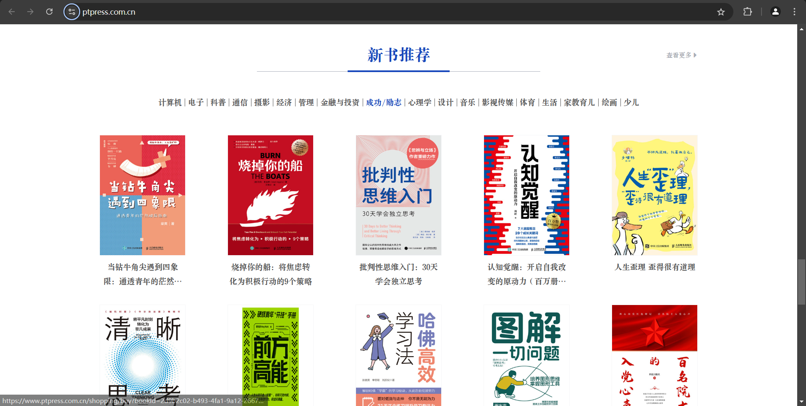

### 1. 页面分析

1. 任意点击到一个图书的详情页面中，并进入开发者模式(快捷键：F12)，选择`Network`，并勾选 `Fetch/XHR`选项，刷新(快捷键：F5)，通过检查发送过来的所有的包，可以发现，`getBookDetailsById`包里面的数据正是我们需要的数据：

   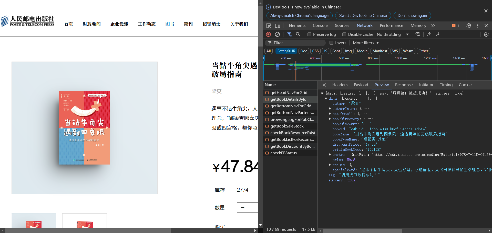

2. 查看该包的 `Headers`，可以直接看到，该包是通过发送一个`POST`请求得到的：

   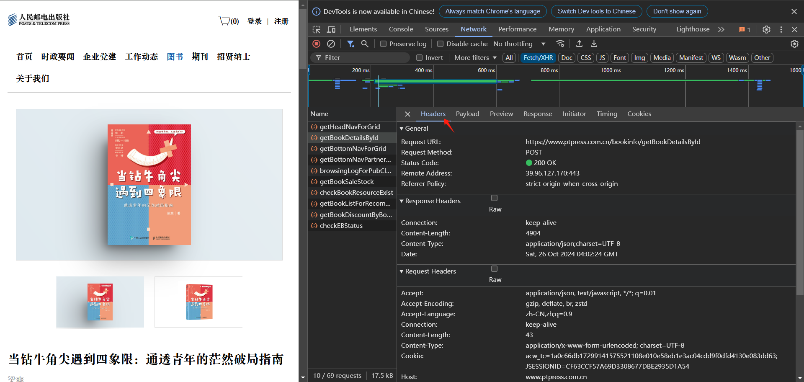

3. 查看`Payload`，可以看到，`POST`请求发送的数据是一个 `bookId`，那么接下来我们就需要寻找到所有的 `bookId`，以便构造`POST`请求：

   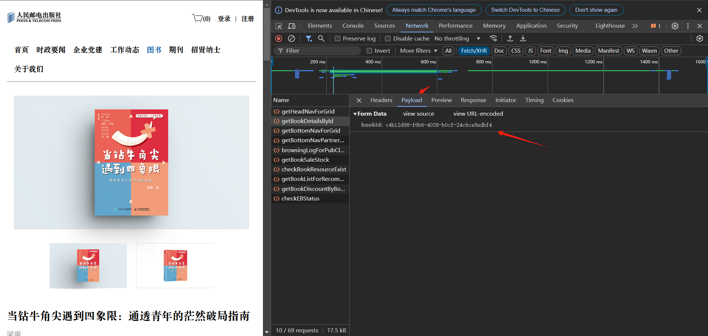

4. 再次回到首页，打开开发者模式，选择`Network`，并勾选 `Fetch/XHR`选项：

   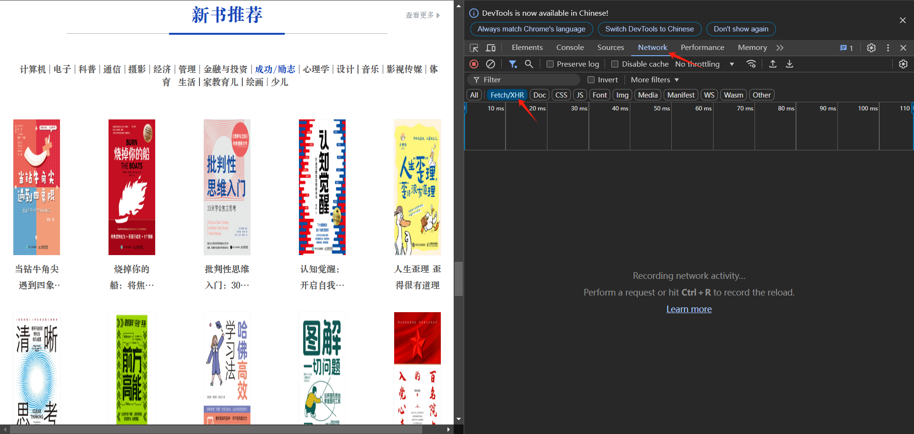

5. 刷新页面(快捷键：F5)，并再次选择 `成功/励志` 选项，可以看到新出现了一个包，名为：`getRecommendBookListForPortal?bookTagId=e03b1ec7-466e-484c-865c-6738989e306a`：

   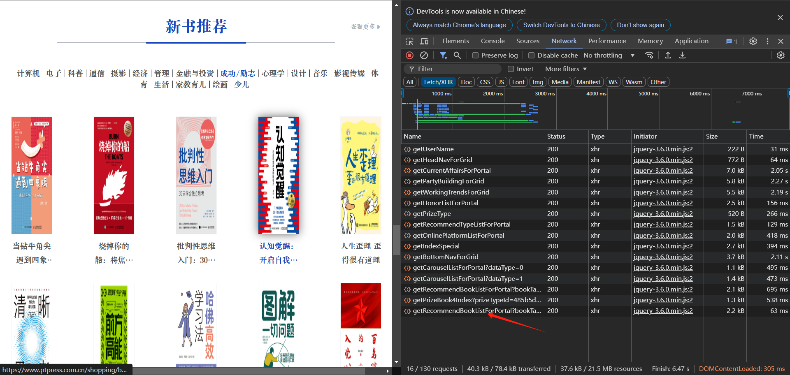

6. 选择该包，并点击`Preview`选项，展开`data`，可以看到 BookName 与 WEB 界面的图书对应，所以这就是我们要找的响应的包，并且该包中包含有我们需要的`bookId`：

   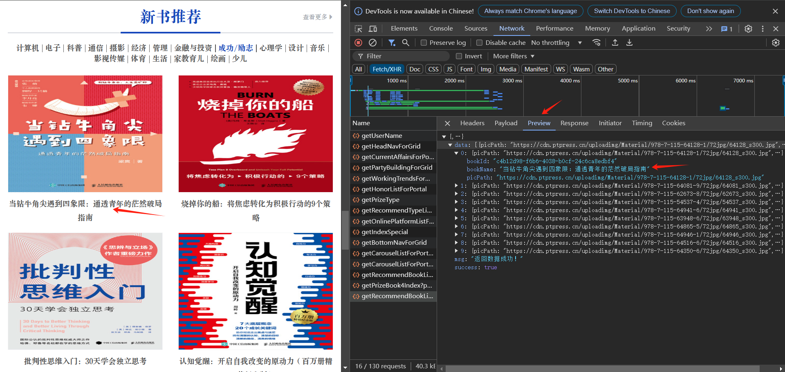

7. 双击该包，可以进入该包的页面，该页面的地址就是我们需要请求的地址，复制该地址：

   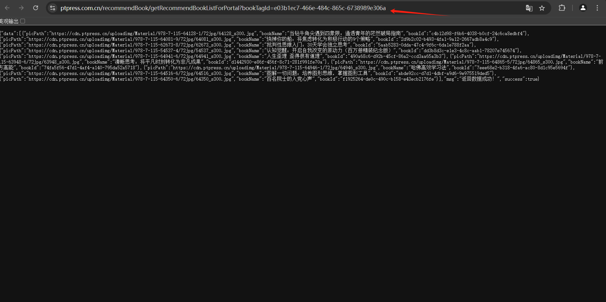

   > 得到该地址的方式有很多种，可以通过查看该包的`Headers`来得到，也可以直接在包名上右键复制`URL`，不必拘泥于选择哪一种方式。

8. 自此，我们已经分析了全部的过程，即先对`https://www.ptpress.com.cn/recommendBook/getRecommendBookListForPortal?bookTagId=e03b1ec7-466e-484c-865c-6738989e306a`发起一个请求，来得到所有的`bookId`，然后通过`bookId`来对`https://www.ptpress.com.cn/bookinfo/getBookDetailsById`发送`POST`请求，通过`Json`解析来得到我们需要的数据即可。

### 2. 代码实现

#### 1. 导入基本的库

```python
import requests
import json
```

#### 2. 构造前置请求

```python
BookId_URL = "https://www.ptpress.com.cn/recommendBook/getRecommendBookListForPortal?bookTagId=e03b1ec7-466e-484c-865c-6738989e306a"
detail_URL = "https://www.ptpress.com.cn/bookinfo/getBookDetailsById"
headers = {'User-Agent':'Mozilla/5.0 (Windows NT 10.0; Win64; x64) AppleWebKit/537.36 (KHTML, like Gecko) Chrome/95.0.4638.69 Safari/537.36 Edg/95.0.1020.44'}
```

#### 3. 对BookId URL 发送请求

```python
book_id_package = requests.get(url=BookId_URL, headers=headers, timeout=3)
if book_id_package.status_code == requests.codes.ok:
    print("SUCCESS")
else:
    print("FAIL")
```

#### 4. 得到所有的 bookId

```python
BookJson = json.loads(book_id_package.content)
BookData = BookJson["data"]
bookId = []
# 通过遍历得到所有的ID
for book in BookData:
    bookId.append(book['bookId'])
bookId
```

#### 5. 构造POST请求函数 与 JSON解析函数

```python
def req_post(url, data):
    data = {
        'bookId': data
    }
    response = requests.post(url, headers=headers, data=data, timeout=3)
    if response.status_code == requests.codes.ok:
        print("SUCCESS")
        return response
    else:
        print("FAIL")
        return None
    
def parse(response):
    json_parse = json.loads(response.content)['data']
    # 得到书名、价格和作者
    book_name = json_parse['bookName']
    author = json_parse['author']
    price = json_parse['discountPrice']
    return book_name, author, price
```

#### 6. 迭代所有的bookId爬取所有图书数据

```python
book_name_ls = []
author_ls = []
price_ls = []
for b_id in bookId:
    # 请求
    response = req_post(detail_URL, b_id)
    # 解析
    book_name, author, price = parse(response)
    book_name_ls.append(book_name)
    author_ls.append(author)
    price_ls.append(price)
    
book_name_ls
```

#### 7. 存储为CSV文件

```python
import pandas as pd

data = {
    'bookName': book_name_ls,
    "author": author_ls,
    "price": price_ls
}

df = pd.DataFrame(data)
df.to_csv("励志-励志.csv", index=True)
```

#### 8. 结果：

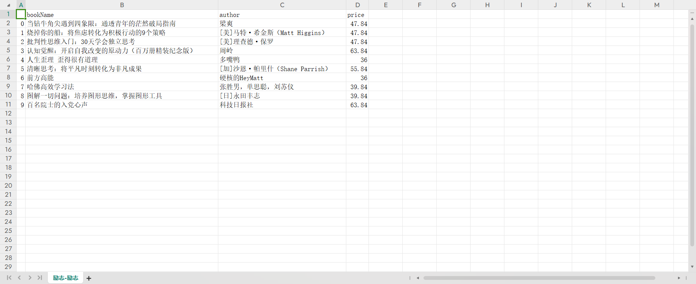

## selenium 的使用

Selenium 是一个自动化测试工具，广泛用于测试 Web 应用程序，可以模拟用户在浏览器中的操作，对于一些比较复杂的页面，可以使用Selenium进行爬取数据。

### 1. 安装 selenium 库

```powershell
pip3 install selenium
```

### 2. 配置 WebDriver

Selenium 需要一个 WebDriver 来与浏览器进行交互。你需要根据你使用的浏览器下载相应的 WebDriver，并将其路径配置到系统路径中或直接指定路径。

如果使用的是Chrome浏览器，可以下载`Chrome Driver`来连接到Chrome浏览器。参考链接：https://blog.csdn.net/zhoukeguai/article/details/113247342

### 3. 方法详解

- 启动浏览器，并打开一个网页：

  ```python
  from selenium import webdriver
  
  # 启动 Chrome 浏览器
  driver = webdriver.Chrome()
  
  # 打开网页
  driver.get("https://www.example.com")
  
  # 关闭浏览器
  driver.quit()
  ```

- 查找元素的方法，Selenium 在版本 4 之后，推荐使用更统一的查找元素的方式，主要通过 `find_element` 方法和 By 类来实现。这种方式更加一致和简洁，避免了一些历史遗留的冗余方法。该方法返回一个具体的标签。

  - **通过 ID 查找元素**:

    ```python
    element = driver.find_element(By.ID, "element_id")	# 第二个参数是需要定位的 id 的值
    ```
  
  - **通过Name查找元素**：
  
    ```python
    element = driver.find_element(By.NAME, "element_name")
    ```
  
  - **通过Class Name 查找元素**：
  
    ```python
    element = driver.find_element(By.CLASS_NAME, "element_class")
    ```
  
  - **通过 Tag Name 查找元素**：
  
    ```python
    element = driver.find_element(By.TAG_NAME, "element_tag")
    ```
  
  - **通过Link Text查找元素**：
  
    ```python
    element = driver.find_element(By.LINK_TEXT, "Link Text")
    ```
  
  - **通过Partial Link Text查找元素**：
  
    ```python
    element = driver.find_element(By.PARTIAL_LINK_TEXT, "Partial Link Text")
    ```
  
  - **通过CSS选择器查找元素**：
  
    ```python
    element = driver.find_element(By.PARTIAL_LINK_TEXT, "Partial Link Text")
    ```
  
  - **通过XPath查找元素**：
  
    ```python
    element = driver.find_element(By.XPATH, "xpath_expression")
    ```
  
- **查找多个元素**，可以使用 `find_elements()` 方法，该方法返回一个列表，该列表是所有符合条件的标签。该方法与`find_element`的使用方法一致，参数互通：

  ```python
  elements = driver.find_elements(By.CLASS_NAME, "element_class")
  ```

- **点击事件与输入事件**，当定位到一个按钮的时候，可以执行点击事件（`element.click()`）；当定位到一个文本框时，可以执行输入事件（`input_box.send_keys()`）：

  - `click()`: 点击元素。
  - `send_keys()`: 向输入框发送文本。
  - `clear()`: 清空输入框。
  - `get_attribute()`: 获取元素的属性值。

  ```python
  # 定位到的元素是一个按钮
  element = driver.find_element(By.ID, "element_id")
  element.click()
  
  # 定位到的元素是一个文本框
  input_box = driver.find_element(By.NAME, "input_name")
  input_box.send_keys("Hello, Selenium!")
  
  ```

- **查看当前定位的URL**：

  ```python
  print("Now URL: ", driver.current_url)
  ```

- **切换到弹出的新的窗口**：

  ```python
  # 获取所有窗口的句柄
  handles = driver.window_handles
  # 切换到新窗口
  driver.switch_to.window(handles[1])
  ```

- **等待元素加载**：

  - **隐式等待**：设置一个全局等待时间，如果在指定时间内元素未加载完成，则抛出异常。

    ```python
    driver.implicitly_wait(10)  # 等待 10 秒
    ```

  - **显示等待**：使用 `WebDriverWait` 和 `expected_conditions` 来等待特定条件满足。

    ```python
    from selenium.webdriver.common.by import By
    from selenium.webdriver.support.ui import WebDriverWait
    from selenium.webdriver.support import expected_conditions as EC
    
    # 等待直到元素出现
    element = WebDriverWait(driver, 10).until(
        EC.presence_of_element_located((By.ID, "element_id"))
    )
    ```

- **处理 JavaScript 对话框（alert、confirm、prompt）**：

  ```python
  # 切换到 alert 对话框
  alert = driver.switch_to.alert
  # 点击确定按钮
  alert.accept()
  # 点击取消按钮
  alert.dismiss()
  # 输入文本并点击确定
  alert.send_keys("Hello")
  alert.accept()
  ```

- **获取页面内容**：

  ```python
  # 获取网页源代码
  page_source = driver.page_source
  
  # 获取当前 URL
  current_url = driver.current_url
  
  # 获取网页标题
  title = driver.title
  ```

- **处理框架和内嵌框架（iframe）**：

  ```python
  # 切换到 iframe
  iframe = driver.find_element_by_tag_name("iframe")
  driver.switch_to.frame(iframe)
  
  # 操作 iframe 中的元素
  element = driver.find_element_by_id("element_id")
  element.click()
  
  # 切换回主文档
  driver.switch_to.default_content()
  ```

- **处理多窗口和标签, 当你在浏览器中打开多个窗口或标签页时，可以使用 `window_handles` 来管理它们**：

  ```python
  # 获取所有窗口的句柄
  handles = driver.window_handles
  
  # 切换到第一个窗口
  driver.switch_to.window(handles[0])
  
  # 切换到第二个窗口
  driver.switch_to.window(handles[1])
  ```

- **执行Java Script代码**：

  ```python
  # 执行 JavaScript 代码
  driver.execute_script("alert('Hello, Selenium!')")
  
  # 通过 JavaScript 获取元素的文本
  text = driver.execute_script("return document.getElementById('element_id').innerText;")
  ```

- **关闭浏览器**：

  ```python
  driver.quit()
  ```

> 对于有些按钮，不能通过普通的`element.click()`来进行点击，出现的异常为：`ElementClickInterceptedException` 表示你尝试点击的元素被另一个元素遮挡或拦截，导致点击操作无法正确执行。在有些情况下，可以使用 JavaScript 的点击操作可以绕过这种遮挡问题。Selenium 提供了 `execute_script` 方法来执行 JavaScript 代码。
>
> ```python
> from selenium import webdriver
> from selenium.webdriver.common.by import By
> import time
> 
> # 初始化 WebDriver
> driver = webdriver.Chrome()
> 
> # 打开网页
> driver.get("https://example.com")  # 替换为你的目标 URL
> 
> # 尝试找到 "下一页" 按钮并使用 JavaScript 点击
> try:
>     next_button = driver.find_element(By.XPATH, '//*[@id="positionList-hook"]/div/div[2]/div[2]/div/a[7]')
>     driver.execute_script("arguments[0].click();", next_button)
>     time.sleep(5)
>     print("SUCCESS")
> except Exception as e:
>     print(f"点击失败: {e}")
> 
> # 关闭浏览器
> driver.quit()
> ```

## 案例：selenium

> 要求：运用selenium爬取网址：https://www.zhaopin.com/wuhan/，在搜索框中搜索关键字`爬虫`，爬取搜索页面中的所有岗位的**薪水**、**任职要求**、**学历要求**，**工作年限要求**、**公司规模**，**公司名称**等数据（“爬取地区为北京的”）。
>
> 

### 1. 页面分析

通过简单的观察页面，可以知道，如果要爬取全部的数据，我们需要进行登录，因此，第一步我们可以先进行登录，可以定位到登录链接部分，然后点击该链接，进行人工的扫码登录。

然后在进行后续的爬取操作。

搜索`爬虫`关键字后，可以看到，当前的地区为`武汉`，我们的要求是爬取`北京`地区的所有数据，因此我们可以定位到切换地区的按钮：

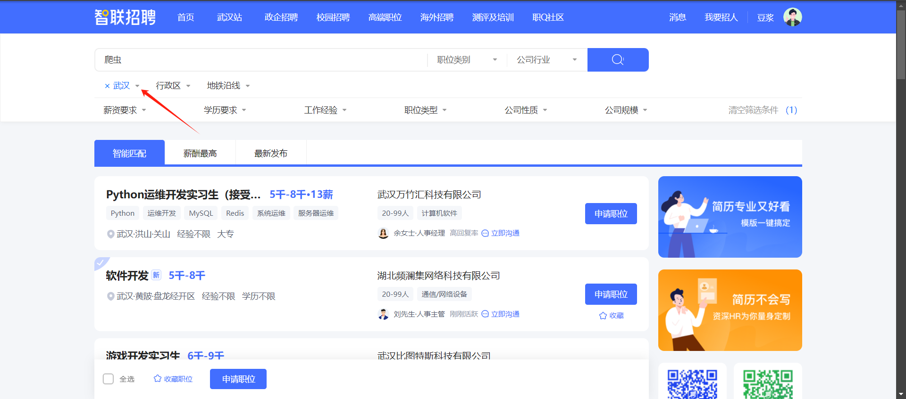

选择地区为`北京`后，即可进行正常爬取数据了：

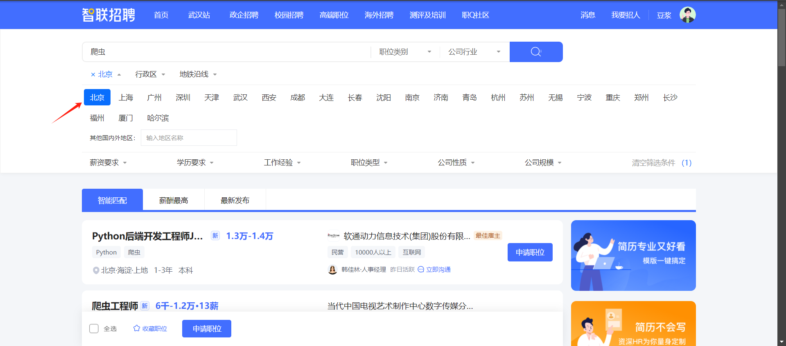

观察需要爬取数据位置：

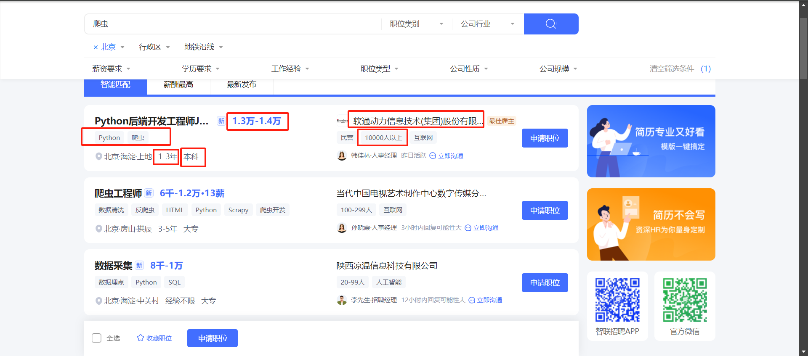

可以看到，需要爬取数据非常明显，每一条数据都在一个岗位条目中，首先我们可以先爬取到当前页面的所有的岗位条目，然后在遍历每一个条目，得到具体的信息，通过详细的分析页面可以观察到有的岗位条目**多了一行任职的详细信息**，有的岗位条目**没有任职的详细信息**，并且**公司规模**的位置也是不定的，有的是在第二个位置，有的是在第一个位置。这是两个变动的因素，因此我们要依次进行考虑。

- 对于第一种变动因素：如果没有任职信息，我们就直接添加一个空字符串，并且着会影响到**学历要求**与**工作年限要求**。通过分析，可以发现，如果有多余行并且有**任职要求**，那么**学历要求**与**工作年限要求**的位置就会在原来的基础上 `+1`，如果既没有多余行也没有**任职要求**，那么**学历要求**与**工作年限要求**的位置就会在原来的基础上 `-1`。
- 对于第二种变动因素：对于第二种变动因素，可以做一下分析，如果**公司规模**行条目有三个，那么**公司规模**就在第二个位置，如果**公司规模**行条目有两个，那么**公司规模**就在第一个位置。

- 如何检测某个元素是否存在呢？

  可以使用`find_elements()`方法来进行间接的检测，使用该方法来定位到需要检测的元素的父级元素，然后使用该方法查找该父级元素的所有子集元素，如果返回列表的长度等于0，表示要查找的元素不存在。可以通过返回的列表的长度来间接的检测某个元素是否存在或者某个父级元素下有几个子级元素。

基于以上分析，我们可以爬取到一个页面的我们所需要的全部的数据了。

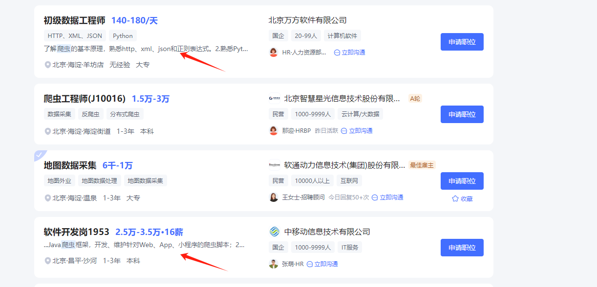

但是我们的目的是爬取到所有页面的数据，因此我们还要在爬取完一个页面之后再次进行爬取下一页，直到最后一个页面结束。思路很简单，我们只需要定位到`下一页`按钮，然后点击即可。但是，在实际爬取中，这个`下一页`按钮是被隐藏的，我们不能直接进行点击，因此需要借助 JavaScript 点击。通过观察网页源码可以发现，`下一页`按钮在该级元素的最后一个，因此可以使用`XPath`定位方式来定位到`下一页`标签的父级元素的最后一个子级元素。为了避免在最后一页的时候不存在`下一页`按钮，我们可以使用`find_elements()`来得到`下一页`按钮元素。

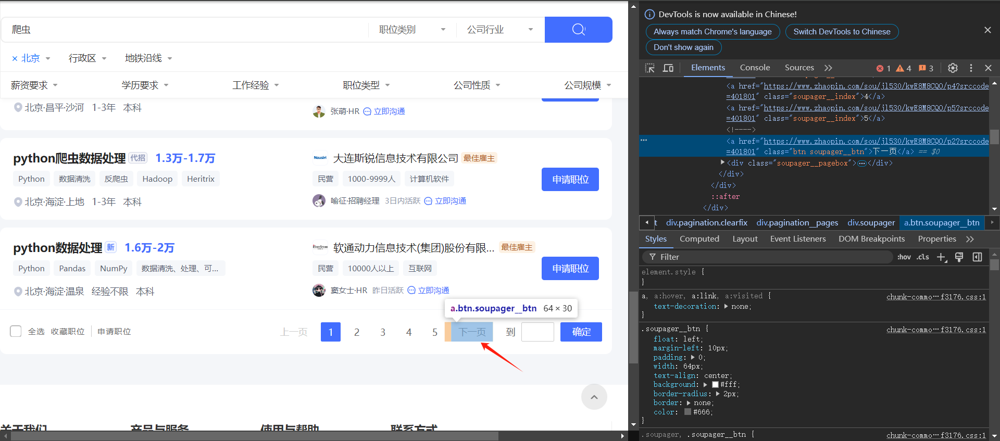

最后确定一下一共有多少一个页面，通过观察页面，可以知道一共有 `11`个页面，因此我们可以设置一个循环来进行迭代`11`次，表示我们爬取每一个页面。

### 2. 代码实现

#### 1. 导入基本的库

```python
# 导入 selenium 库，以及其他必要的库
from selenium import webdriver
from selenium.webdriver.common.by import By
import time
import random
from tqdm import tqdm
```

#### 2. 初始化Chrome

```python
driver = webdriver.Chrome()
driver.get("https://www.zhaopin.com/wuhan/")
time.sleep(5)
```

#### 3. 进行登录

```python
# 定位到该按钮
login_button = driver.find_element(By.XPATH, '//*[@id="root"]/div[1]/div/div[1]/div/div[2]/div[1]/span[1]/a')
# 进行点击
login_button.click()
```

#### 4. 进行人工扫码登录

#### 5. 查看当前定位的URL

```python
current_handle = driver.current_window_handle
print(f"当前页面句柄: {current_handle}")
print("Now URL: ", driver.current_url)
```

#### 6. 设定定位到最新URL页面的函数

```python
# 由于跳转到了一个新的页面，因此需要进行切换
# 获取当前所有页面的句柄
def switch_new_page():
    all_handles = driver.window_handles
    print(f"所有页面句柄: {all_handles}")

    # 切换到最新的窗口
    driver.switch_to.window(all_handles[-1])
    print("Now URL: ", driver.current_url)
    return all_handles[-1]
```

#### 7. 进行跳转

```python
switch_new_page()
```

#### 8. 进行搜索关键字'爬虫'

```python
# 定位到搜索框
search_box = driver.find_element(By.XPATH, '//*[@id="rightNav_top"]/div/div[2]/div/div/div[2]/div/input')
search_box.send_keys("爬虫")

# 定位到搜索按钮
search_button = driver.find_element(By.XPATH, '//*[@id="rightNav_top"]/div/div[2]/div/div/div[2]/button')
search_button.click()
```

```python
print("Now URL: ", driver.current_url)
# 切换到最新的页面
switch_new_page()
```

#### 9. 切换城市为"北京"

```python
flat_button = driver.find_element(By.XPATH, '//*[@id="filter-hook"]/div/div[2]/div/div[1]/a[2]')
flat_button.click()

beijing_label = driver.find_element(By.XPATH, '//*[@id="filter-hook"]/div/div[2]/div[2]/div[1]/ul/li[1]/a')
beijing_label.click()
```

#### 10. 爬取数据

```python
# 一共有11页
money_ls =  []
require_ls  = []
degree_ls = []
work_year_ls = []
company_scale_ls = []
company_name_ls = []

for i in tqdm(range(1, 12), desc="页面", leave=True):
    # 获取每一个条目
    items = driver.find_elements(By.XPATH, '//*[@id="positionList-hook"]/div/div[1]/div[@class="joblist-box__item clearfix"]')
    print("获取第{}个页面，一共有{}个条目".format(i, len(items)))
    for item in tqdm(items, desc="条目", leave=False):  
        # 前置条件
        pos = 3
        require_exit = item.find_elements(By.CLASS_NAME, 'jobinfo__tag')     # 判断需求标签是否存在
        additional = item.find_elements(By.CLASS_NAME, 'jobinfo__hit-reason')
        if len(require_exit) > 0 and len(additional) > 0:
            pos = 4
        elif len(require_exit) == 0 and len(additional) == 0:
            pos = 2
            
        # 进行休眠
#         time.sleep(random.uniform(2, 3.5))
        # 薪水
        money = item.find_element(By.XPATH, 'div[1]/div[1]/div[1]/p').text
        # 任职要求
        require = ""
        if len(require_exit) > 0:
            requires_temp_ls = item.find_elements(By.XPATH, 'div[1]/div[1]/div[2]/div[@class="joblist-box__item-tag"]')
            for require_temp in requires_temp_ls:
                require += require_temp.text + "|"
        # 学历要求
        degree = item.find_element(By.XPATH, f'div[1]/div[1]/div[{pos}]/div[3]').text
        # 工作年限
        work_year = item.find_element(By.XPATH, f'div[1]/div[1]/div[{pos}]/div[2]').text
        # 公司规模 
        parent_element = item.find_element(By.XPATH, 'div[1]/div[2]/div[2]')
        child_elements = item.find_elements(By.TAG_NAME, 'div')
        if len(child_elements) > 3:
            company_scale = item.find_element(By.XPATH, 'div[1]/div[2]/div[2]/div[2]').text
        else:
            company_scale = item.find_element(By.XPATH, 'div[1]/div[2]/div[2]/div[1]').text
        # 公司名称
        company_name = item.find_element(By.XPATH, 'div[1]/div[2]/div[1]/a').text
        
        # 将一个条目的信息添加到列表中
        money_ls.append(money)
        require_ls.append(require)
        degree_ls.append(degree)
        work_year_ls.append(work_year)
        company_scale_ls.append(company_scale)
        company_name_ls.append(company_name)
    
    # 休眠
    time.sleep(random.uniform(2, 5))
    # 进入下一页 
    parent_next_button = driver.find_element(By.XPATH, '//*[@id="positionList-hook"]/div/div[2]/div[2]/div')
    next_buttons = parent_next_button.find_elements(By.XPATH, './*[last()]')
    if len(next_buttons) > 0:
        driver.execute_script("arguments[0].click();", next_buttons[0])
    time.sleep(5)
print("SUCCESS")
```

#### 11. 查看爬取到的数据

```python
# 输出每一个的最后5条数据
print(money_ls[-5:])
print(require_ls[-5:])
print(degree_ls[-5:])
print(work_year_ls[-5:])
print(company_scale_ls[-5:])
print(company_name_ls[-5:])
```

#### 12. 进行持久化存储 —— CSV格式

```python
import pandas as pd
```

```python
# 构造数据
data = {
    "公司名称": company_name_ls,
    "薪水": money_ls,
    "任职要求": require_ls,
    "学历要求": degree_ls,
    "工作年限要求": work_year_ls,
    "公司规模": company_scale_ls
}
# 转换格式进行存储
df = pd.DataFrame(data)
df.to_csv("智联招聘-爬虫.csv", index=True)
```

#### 13. 退出浏览器

```python
driver.quit()
```
